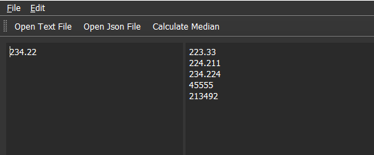
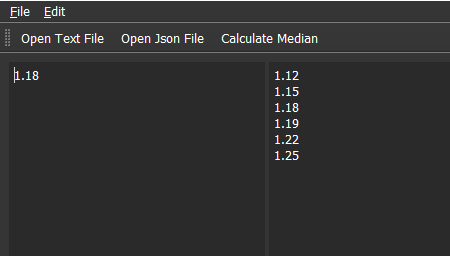

# Median Calculator
Median calculator is a software tool built with Qt Widgets that calculates a median values either from text file or json.


**The program does The following :-**
1) it shows an ascending sorted list of all values from the file
2) show the calculated method with percision of two values after the comma 


 
3) It also support reading From Json files with the following format


```json
{
    "Values" : [
        {
             "x" : 1.12,
             "y" : 1.19
         },
        {
             "x" : 1.15,
             "y" : 1.22
         },
        {
             "x" : 1.18,
             "y" : 1.25
         }
    ]
}
```
 It sort all the values then takes their median as follows:-


## Build On Linux
```bash
git clone https://github.com/MohamedHeshamMustafa/QtApp.git 
cd QtApp
mkdir build; cd build
cmake --build .
```

## Build On Windows using visual Studio code and vcpkg as a toolchain
you need to install Qt in your vcpkg 
